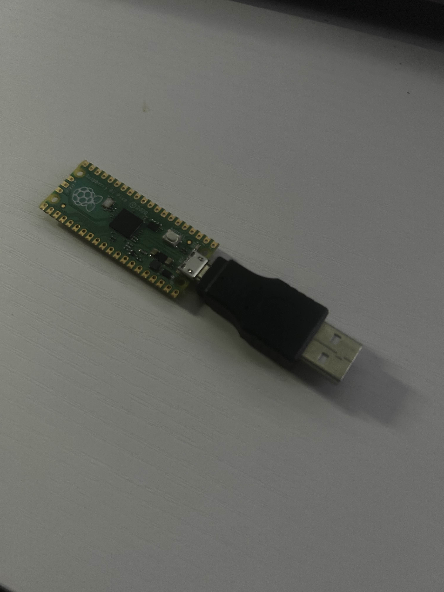
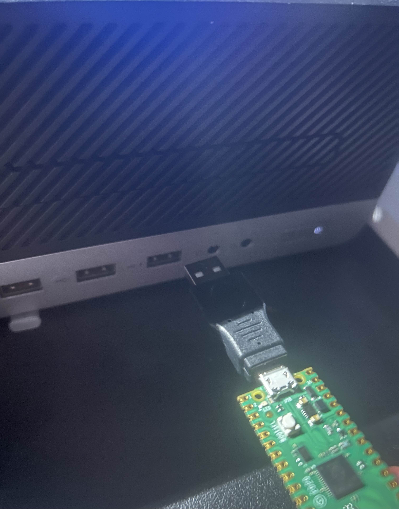

# Raspberry Pi Pico USB Keyboard Launcher

A small Raspberry Pi Pico project written in Python that emulates a USB keyboard.  
When plugged into a computer, it automatically types a series of keystrokes through the operating system to open a specific webpage.  
It’s lightweight, easy to use, and can be customized to navigate to any URL of your choice.

  
  

